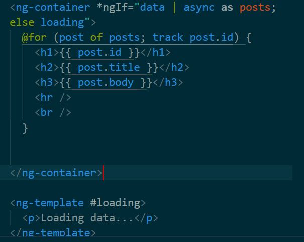

# Data binding and its type
```
export class AppComponent {
  title = 'angular-start';
}
```
in our html template we can bind that data
```
<main>
  <h1>Hello {{title}}</h1>
</main>
```
### Property binding and attribute binding
```
 <button [disabled]="isStarting" class="bg-blue-600" type="button" >{{isStarting ? "Good luck" : "Lets go"}}</button>
```
We used attribute binding in the disabled attribute
we can use for images as well like
```
</img>
```
img is a variable whcih is the path

### style binding 
```
<button 
  [class.bg-blue-500]="isPrimary" 
  [class.bg-gray-500]="!isPrimary"
  class="text-white px-4 py-2 rounded">
  Click Me
</button>
```
- [class.bg-blue-500]: Adds the Tailwind class bg-blue-500 when isPrimary is true.
- [class.bg-gray-500]: Adds the Tailwind class bg-gray-500 when isPrimary is false.
#  2 way Data Binding and Built in Attribute Directives
## Functions binding
simple counter example 
```
export class AppComponent {
  counter=0

  increment(){
    this.counter++
  }
}
```
```
<button type="button" (click)="increment()" >Increase</button>
<hr>
<h1>{{counter}}</h1>
```
## 2 Way data binding
In Angular, two-way data binding is achieved using the [(ngModel)] syntax
```
<input [(ngModel)]="inputText" type="text">
<h2>{{inputText}}</h2>
```

when the value changed in the template it will be changed back in the component
- so using the ng model we bind the value from the component ,  we change and we send it back to the component , this is data binding  
# Structure Directives | ngIf ngFor and ngSwitch
## ng if
```
<h2 *ngIf="isLoggedIn && isAdmin" class="block mb-2 text-sm font-medium text-gray-900 dark:text-white">Welcome user</h2>
<h2 *ngIf="!isLoggedIn" class="block mb-2 text-sm font-medium text-gray-900 dark:text-white">Not logged</h2>
```
we can also add an else 
```
<h2 *ngIf="isLoggedIn;else loggedOut">Welcome user</h2>
<ng-template #loggedOut><h1 class="font-bold">Sessions over</h1></ng-template>
```
*the ng-template is not a dom element , we can nest inside it our dom*
## ngFor
```
<ul>
  <li *ngFor="let user of users ; let i=index">The user number {{i+1}} is {{user}}</li>
</ul>
```
the index variable contain the index of current item
## ngSwitch
```
<div [ngSwitch]="grade">
  <h1 *ngSwitchCase="'A'">Exellent</h1>
  <h1 *ngSwitchCase="'B'">Meduim</h1>
  <h1 *ngSwitchCase="'C'">Bad</h1>
  <h1 *ngSwitchDefault>Unkonwn grade</h1>
</div>
```
# New Control Flow @if @for and @switch
## @if @else
```
@if (a>b) {
<h1>A:{{a}} is greater than b {{b}}</h1>
} @else {
  <h1 class="font-bold">B:{{b}} is greater than A {{a}}</h1>
}
```
## @for
```
@for (item of items; track item.id ; let total=$count ; let i=$index) {
<h1 class="font-bold">{{i+1}} :{{item.name}}</h1>
@if (i==total-1) {
  Total number of users : <p>{{total}}</p>
}
}
```
The track function returns a unique identifier for each item in the list.
When Angular detects changes in the collection, it uses this identifier to determine:
Which items have been added.
Which items have been removed.
Which items have been reordered.
## @switch
```
@switch(grade){
  @case ('A'){
    <h1>exellent</h1>
  }
  @case ('B'){
    <h1>exellent</h1>
  }
  @default {
    <h1>Uknown grade</h1>
  }
}
```

# Built-in and Custom Pipes
## Built-in 
First we need to import `DatePipe` `LoweCasePipe`...
```
<h1 >{{name | uppercase }}</h1>
<h1 >{{name | lowercase }}</h1>
<h2>{{date | date :"short" }}</h2>
<h2>{{date | date :"full" | uppercase }}</h2>
```

there a refer to the documentation where you can find all built in pipes
## Custom Pipes
First we need to create a new pipe file
`ng generate pipe pipes/append`
then the pipe file is generated we can go and customize the transform function
```
import { Pipe, PipeTransform } from '@angular/core';

@Pipe({
  name: 'append'
})
export class AppendPipe implements PipeTransform {

  transform(value: string , appendText:string): string {
    return value==null ? value :value+appendText;
  }

}
```
this pipe used to cancat a string with another one , so we can use just like built in pipes inside our template
```
<h2>{{name | append:"ELmechrafi" | uppercase}}</h2>
```
# Dependency Injection and Services for API Calls with HttpClient
- In Angular, a service is a class used to encapsulate reusable logic, data, or functionality that can be shared across components, directives, and other parts of the application.
 - First, to generate a service we use the command
`ng generate service services/servicesName`
or `ng g s services/serviceName`
- Heres the generated service
```
@Injectable({
  providedIn: 'root'
})
export class DataService {
  getData(){
    return ["data1", "data2", "data3", "data4"]
  }
  constructor() { }
}
```
In Angular, dependency injection (DI) is a design pattern that allows a class (such as a component or another service) to receive an instance of a service it depends on, rather than creating it manually. This is where Angular services and their @Injectable() decorator come into play. 
1.  The @Injectable() decorator makes the service eligible for dependency injection.
2. The providedIn: 'root' option registers the service at the root injector level, making it a singleton (a single instance is shared across the entire app).

- Now heres how to use the service inside the component :
1. we need to add it to providers array
`providers:[DataService]`
2. and then we can use it without instanciation
```
export class AppComponent {
 data:string[]=[]
 constructor(private dataService:DataService){
this.data=this.dataService.getData()
 }
  
}
```
## Using an api
In Angular, an **Observable** is a core part of **RxJS (Reactive Extensions for JavaScript)**, which enables asynchronous programming. Observables represent a **stream of data** or events that can be observed and reacted to over time
- **Subscription:** To "listen" to an Observable's data, you call the `subscribe()` method, which attaches an observer to the Observable.
- **Emission:** The Observable emits data (or events) to its subscribers.
- **Completion/Errors:** The Observable notifies subscribers when the stream completes or if an error occurs.

```
@Injectable({
  providedIn: 'root'
})
export class DataService {
  constructor(private http:HttpClient) {}
  getData(apiUrl:string):Observable<Data[]>{
   return this.http.get<Data[]>(apiUrl);
  }
}
```

then we can use this service inside our component
```typescript
export class AppComponent {
 data:Data[]=[]
 constructor(private dataService:DataService){
  
 }
 ngOnInit(): void {
  this.dataService.getData('https://jsonplaceholder.typicode.com/posts').subscribe(
    (data)=>{
    this.data=data
  }
   , (error)=>{console.log(error)});
 }
  
}
```
inside our template :
```html
@for (post of data; track post.id) {
 <h1>{{post.id}}</h1>
 <h2>{{post.title}}</h2>
 <h3>{{post.body}}</h3>
 <hr>
 <br>

}
```
## async pipe vs subscribe
The AsyncPipe in Angular can replace manual subscribe calls when working with observables, providing a cleaner and more declarative way to handle asynchronous data in templates.
The **`AsyncPipe`** in Angular can replace manual `subscribe` calls when working with observables, providing a cleaner and more declarative way to handle asynchronous data in templates. Here's how:

---

### **What is the AsyncPipe?**
The `AsyncPipe` is a built-in Angular pipe that:
1. **Automatically subscribes** to an observable or promise.
2. **Automatically unsubscribes** when the component is destroyed, avoiding memory leaks.
3. Allows direct binding of the observable to the template.
**Using the async pipe lets Angular manage the subscription, so we know the subscription is destroyed when the component is destroyed (i.e., when the user navigates to a new page). And our code looks tidier :)**
---

### **Manual `subscribe` vs AsyncPipe**

#### Manual `subscribe`:
When using `subscribe`, you need to:
- Manually handle the subscription in the component.
- Unsubscribe explicitly (e.g., using `OnDestroy` or `takeUntil`) to avoid memory leaks.

Example:
```typescript
import { Component, OnInit, OnDestroy } from '@angular/core';
import { PostService } from './post.service';
import { Subscription } from 'rxjs';

@Component({
  selector: 'app-posts',
  template: `
    <div *ngFor="let post of posts">
      <h2>{{ post.title }}</h2>
      <p>{{ post.body }}</p>
    </div>
  `,
})
export class PostsComponent implements OnInit, OnDestroy {
  posts: any[] = [];
  private subscription: Subscription;

  constructor(private postService: PostService) {}

  ngOnInit(): void {
    this.subscription = this.postService.getPosts().subscribe((data) => {
      this.posts = data;
    });
  }

  ngOnDestroy(): void {
    // Unsubscribe to prevent memory leaks
    this.subscription.unsubscribe();
  }
}
```

#### Using the `AsyncPipe`:
With the `AsyncPipe`, you bind the observable directly to the template, and Angular handles the subscription/unsubscription automatically.

Example:
```typescript
import { Component } from '@angular/core';
import { PostService } from './post.service';
import { Observable } from 'rxjs';

@Component({
  selector: 'app-posts',
  template: `
    <div *ngFor="let post of posts | async as post">
      <h2>{{ post.title }}</h2>
      <p>{{ post.body }}</p>
    </div>
  `,
})
export class PostsComponent {
  posts$: Observable<any[]>; // Observable directly used in the template

  constructor(private postService: PostService) {
    this.posts$ = this.postService.getPosts();
  }
}
```

---

### **Benefits of Using AsyncPipe:**
1. **Cleaner Code**:
   - No need to manually manage subscriptions in the component.
   - Directly binds the observable to the template.
2. **Prevents Memory Leaks**:
   - Automatically unsubscribes when the component is destroyed.
3. **Declarative Approach**:
   - Moves the subscription logic from the component to the template.
4. **Less Boilerplate**:
   - Avoids writing `ngOnDestroy` or managing `Subscription` objects explicitly.

---

### **When to Use `AsyncPipe`:**
- Use `AsyncPipe` when you don't need to manipulate or process data in the component before displaying it.
- If you need to perform additional operations on the data, you can still subscribe in the component and update a property.

### **When to Use `subscribe`:**
- Use `subscribe` when you:
  - Need to perform side effects (e.g., logging, error handling).
  - Need to interact with other services or state management.
  - Process or transform the data before using it.

---


# Signal | Computed | Effect
 - Signals in Angular are a reactive state management feature introduced to simplify reactivity and improve performance. They allow components and services to manage state in a declarative, fine-grained way, making it easier to track changes and propagate updates efficiently.
 ## how angular detects changes ?
 
 - altough angular does that effeciently  its heavy handed cause we need to check the entire tree for changes 
 - also we have the problem of values that depends on the state
 ## rxjs
 
 - To solve that we use rxjs Observables: Behavior subjects ,which are complex to use
 - We need to subscribe using async pipe in the template to pull values out 

 ## signals
 
 with signals we can access the values directy without subscribtion
 ## when to use each ones
 - signals are great to handle synchronous reactivity where the value is known and can eb set immediately like incrementing a counter
 - example of search filters
 
For example here signals cannot handle multiple request , if the first one take some time and another request has been made after it , with signals we dont have tools to control which request to serve first which tottaly provided in rxjs observables
- rxjs is great when it comes to asynchronous reactivity operations , we got tools like switchmap that helps decide which request will win ...

# Enhance both: use signals and rxjs
- we can just start with signals and the if we need to , we will be able to convert a signal into and observable and the inverse to access its value directly in the template

# Deep dive into signals
writable signals :
- we use update to update the value based on the previous => best practice
- and set to set a value directly :'this.count.set(7)'
```
count=signal<number>(0)
increment(){
  this.count.update((value)=>value+1)
}
//in template
  <h1 class="font-bold text-4xl">The value{{count()}}</h1>
```
## updating an array using mutate
```
arr=signal<number[]>([1,1,5])
increment(){
  this.count.update((value)=>value+1)
}
addElement(){
  this.arr.update((values)=> [...values,200])
}
  
```
## computed signals
- Used to manage side effects
```
count=signal<number>(0)
doubleCount=computed(()=>this.count()*2)
```
if count changes doubleCount will be changed automatically
## effects
- Effects in Angular are a part of the Signals API, introduced to handle side effects in a clean and reactive way. Effects allow you to run code in response to changes in signals without directly affecting the application state or U
- Avoid Updating Signals Inside Effects: This can lead to infinite loops if not carefully managed. Use effects to trigger side-effect logic, not to manage state directl

- effect runs at least once when it is created. This is because effects are designed to execute their logic immediately upon initialization to establish their dependencies and perform any necessary initial side effects.
```
count=signal<number>(0)
constructor(){
  effect(()=>{console.log("The count value is" , this.count())});
}
```
the signal will run automatically when the count value changes (and when the components is initialized)

## Build Template Driven Forms 
- first we need to import FormsModule 
```html
<form class="max-w-sm mx-auto" #login="ngForm" (ngSubmit)="onFormSubmit(login)">
```
we give a name reference to the template and we define a function that will run when the form is submitted , and we pass to this function the referece of the form which is of type **ngFor0** which is a directive used to 
- #login="ngForm" binds the NgForm directive instance for this <form> element to the myForm variable.
You can now use myForm in the template:
login.invalid: Checks if the form is invalid.
login.controls: Accesses individual form controls.
- to access the ngForm field we have to do twe thing 
1. Adding name attribute to each form field
2. Adding  **ngModel**  to each form field 
```html
<input ngModel name="password" type="password" id="password"  required />
```
Now we can access the values of these properties in our Component file
```typescript
export class AppComponent {

onFormSubmit(login:NgForm){
  if(login.valid)
  console.log(login.value.password)
}
  
}
```
- `login.valid` checks if all the fields are filled
## adding some custom validation
first we add two way data binding to fields
```html
<input [(ngModel)]="user.email" name="email" type="email"
```
and this is validation function
```typescript
validateEmail() {
    const emailRegex = /^[^\s@]+@[^\s@]+\.[^\s@]+$/;
    return emailRegex.test(this.user.email);
  }
```
and we can use this to enable the submit button or show error messages ...
```html
    <button [disabled]="!validateEmail()" type="submit">Submit</button>
```
# Build Reactive Forms
1. The first thing is to import ReactiveFormModule
2. Then we can go and define our form group 
```typescript
 loginForm:FormGroup
  constructor(private fb:FormBuilder){
    this.loginForm=this.fb.group({
      email:['',[Validators.required , Validators.email]],
      password:['',[Validators.required ,Validators.minLength(6)]],
    }) //validators must be in an array if theres more than one
  }

  onSubmit(){
    if(this.loginForm.valid){
      this.loginForm.value
    }
```
- FormBuilder: A service that provides convenient methods for creating instances of FormGroup and FormControl.
- FormGroup: Represents a group of form controls. It aggregates the values of each control into a single object.
- FormControl: Represents a single input field a form control instance manages the value, validation status, and user interactions of an input field.

3. We should link the formGroup with the template:
- we Use the [formGroup] directive to bind the FormGroup instance created in the component to the <form> tag in the template.
```html
<form [formGroup]="loginForm" >
```
- Link Controls with formControlName: Use the formControlName directive inside the form to bind the individual controls defined in the FormGroup to input elements.
Example:
```html
 <input formControlName="password"  type="password" required />
```
# What are Components | Components Communication #14
## Passing data from parent to child 
in the parent component 
```html
<app-form />
@for (task of tasks; track $index) {
  <app-task [taskVal]="task" />
}

```
we pass the data in taskVal 
- to recieve the data in the child component we use 
```typescript
export class TaskComponent {
@Input() taskVal!:string
}
  
```
- @Input Allows a parent component to pass data to a child component.

## Passing data from child to parent
- If we have a button on the child component that should trigger something in the parent for example we may need to pass some kind of data from child to parent
```html
//in child component
<p class="text-red-400 text-sm">{{taskVal}}</p>
<button >Delete task</button>
```
- @Output Allows a child component to emit events to the parent component.
- we Use an EventEmitter to emit the event.
```typescript
export class TaskComponent {
@Input() taskVal!:string
@Output() deleteTask=new EventEmitter()

onDeleteClick(){
  this.deleteTask.emit()
}
}
```
now we need to trigger the event in the child template when the button is clicked
```html
<button (click)="onDeleteClick()" >
```
- we Use event binding ((event)) to listen for the event in the parent template.
```html
@for (task of tasks; track $index) {
  <app-task [taskVal]="task" (deleteTask)= "deleteTask(task)" />
}
```
the function deleteTask() should be defined inside the parent component
```typescript
deleteTask(task:string){
    this.tasks=this.tasks.filter((t)=>t!=task)
  }
```
# Routing | Dynamic Routing | Nested Routing #15
## defining routes
we define routes in app.routes.ts
```typescript
export const routes: Routes = [
  {path:'tasks' , component: TaskComponent},
  {path:'form' , component:FormComponent},
  { path: 'user/:id', component: UserComponent },
  { path: '**', redirectTo: '' } // Wildcard route for 404 
];
```
Dont forget to import RouterModule inside app.component.ts
## Add routes outles in the template
```html
<main class="h-screen flex justify-center items-center">

<nav>
  <ul>
    <li><a routerLink="">Home</a></li>
    <li><a [routerLink]="['user', '1']" routerLinkActive="active">users</a></li>
    <li><a routerLink="/tasks" routerLinkActive="active">Tasks</a></li>
    <li><a routerLink="/form" >Form</a></li>
  </ul>
</nav>
<router-outlet></router-outlet>
</main>

```
we can also navigate between links programitically 
```html
<form [formGroup]="loginForm" (ngSubmit)="onSubmit()" class="max-w-sm mx-auto">
```
```typescript
onSubmit(){
    if(this.loginForm.valid){
      this.loginForm.value
      this.router.navigate(['/tasks'])
    }
  }
```
## Route Params
```typescript
{ path: 'user/:id', component: UserComponent }
Link to Route:
```

```html
<a [routerLink]="['/user', userId]">View User</a>
```
Access Parameters in Component:

```typescript
import { ActivatedRoute } from '@angular/router';

constructor(private route: ActivatedRoute) {}

ngOnInit() {
  const id = this.route.snapshot.paramMap.get('id');
  console.log('User ID:', id);
}
```
## Querry params
To pass optional parameters in the URL.
```html
<a [routerLink]="['/search']" [queryParams]="{ query: 'angular' }">Search</a>

```
accessing paarams in the components 
```typescript
this.route.queryParams.subscribe(params => {
  console.log(params['query']);
});

```
## Nested routes
```typescript
{
    path: 'dashboard',
    component: DashboardComponent,
    children: [
      { path: 'profile', component: ProfileComponent },
      { path: 'settings', component: SettingsComponent },
    ],
  },
  ```
  set up components outles
  ```html
  <h2>Dashboard</h2>
<nav>
  <a routerLink="profile">Profile</a>
  <a routerLink="settings">Settings</a>
</nav>
<router-outlet></router-outlet>

```
to navigate to child routes we can use relative path to the current route of the component
```
<a routerLink="profile">Profile</a>
<a routerLink="settings">Settings</a>

```
programatically
```typescript
navigateToProfile() {
  this.router.navigate(['profile'], { relativeTo: this.route });
}
```
## Route guards
First we need to generate the guard
`ng generate guard auth
`
```typescript

export const authGuard: CanActivateFn = async (route, state: RouterStateSnapshot) => {
  const session = false; // Simulating the session status (false means not authenticated)

  const router: Router = inject(Router);

  // If session is false, navigate to the '/tasks' route
  if (!session) {
    await router.navigate(['/tasks']);
    return false; // Prevent navigation to the original route
  }

  // If session is true, allow navigation
  return true;
};

};


```
And then we apply the guard to the route
```typescript
{ path: 'dashboard', component: DashboardComponent, canActivate: [AuthGuard] }

```
# Lazy Loading Feature Modules #16
```typescript
import { bootstrapApplication } from '@angular/platform-browser';
import { provideRouter } from '@angular/router';
import { AppComponent } from './app/app.component';

bootstrapApplication(AppComponent, {
  providers: [
    provideRouter([
      { path: '', redirectTo: 'home', pathMatch: 'full' },
      { path: 'home', loadComponent: () => import('./app/home.component').then(m => m.HomeComponent) },
      { path: 'about', loadComponent: () => import('./app/about.component').then(m => m.AboutComponent) },
    ]),
  ],
});
```
instead of putting the compoentnt directly we lazy load it when requested